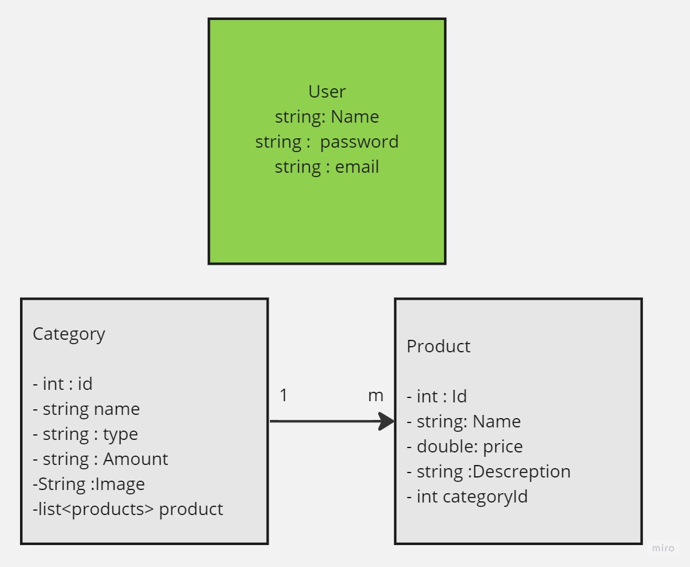

# E-Commerce ASP.Net core(MVC) wep app  project for E-commerce Market.

The Project  is a robust and user-friendly platform designed to empower administrators with efficient product and category management capabilities. The application is tailored to meet the specific needs of administrators who wish to streamline their product catalog and enhance their online storefront. Below are the key features and functionalities of our application:

 

## Table of Contents

- [Features](#features)
- [Getting Started](#getting-started)
- [Usage](#usage)
- [Technologies Used](#technologies-used)
- [File Structure](#file-structure)
- [Uploading Images to Azure Blob Storage](#uploading-images-to-azure-blob-storage)
- [ERD](#erd)

## Features

### 1. Admin Dashboard

- **Dashboard Overview**: As an admin user, you can access a comprehensive dashboard displaying a list of product categories, providing an at-a-glance view of your product catalog.

### 2. Category Management

- **Category Detail View**: Easily view detailed information for each category, allowing you to make informed decisions regarding edits or deletions.

### 3. Product Listing by Category

- **Category-Product Association**: Seamlessly navigate from a category's detail page to a list of products assigned to that category, improving product organization and accessibility.

### 4. Product Management

- **Product Detail View**: Gain a deeper understanding of your products by accessing individual product detail pages for efficient editing or removal.

### 5. Category Creation

- **Add New Categories**: As an administrator, you can effortlessly create and save new product categories, enabling the expansion of your product lines.

### 6. Product Creation

- **Add New Products**: Easily add and save new products, empowering you to grow your inventory effortlessly.

### 7. Category-Product Association

- **Effortless Association**: Seamlessly associate products with specific categories to enhance user navigation and browsing.

### 8. Deletion Capability

- **Manage Inventory**: Administrators have the flexibility to delete both products and categories as needed, ensuring a well-maintained catalog.

### 9. Real-time Category Editing

- **Dynamic Storefront Structure**: Modify category information in real-time, adapting your storefront structure to meet changing needs.

### 10. Real-time Product Editing

- **Inventory Flexibility**: Edit and modify product details in real-time, enabling quick adjustments to your inventory.

 

# sumarry for Features

- User Authentication (Registration, Login, Logout)
- Role-based Access Control (Administrator, Editor)
- Product Management (Add, Edit, Delete)
- Image Upload to Azure Blob Storage
  
    

 ## Getting Started

To get started with this project, follow these steps:

### Prerequisites

- **Operating System**: Windows (ASP.NET is primarily designed for Windows).
- **Development Environment**:
  - [Visual Studio](https://visualstudio.microsoft.com/) (Community edition is suitable for most projects).
  - [Visual Studio Code](https://code.visualstudio.com/) (Optional, for ASP.NET Core).
- **.NET Framework or .NET Core/ASP.NET Core**:
  - [.NET Framework](https://dotnet.microsoft.com/) (for traditional ASP.NET applications).
  - [.NET Core/.NET 5+](https://dotnet.microsoft.com/) (for modern ASP.NET Core applications).
- **Web Server**: [Internet Information Services (IIS)](https://www.iis.net/).
- **Database Server**: Depending on your application, you may need a database server such as Microsoft SQL Server, MySQL, PostgreSQL, or SQLite.
- **.NET Development SDK**: Install the [.NET Core SDK](https://dotnet.microsoft.com/download/dotnet-core) or [.NET 5+ SDK](https://dotnet.microsoft.com/download/dotnet/5.0) for ASP.NET Core applications.
- **Web Browser**: Any modern web browser for testing and viewing your application.
- **Version Control (Optional)**: [Git](https://git-scm.com/) or a Git client such as [GitHub Desktop](https://desktop.github.com/) or [SourceTree](https://www.sourcetreeapp.com/).
- **Basic Web Development Knowledge**: Familiarity with HTML, CSS, and JavaScript for web page development.
- **C# Programming Knowledge**: Understanding of C# and object-oriented programming (OOP) concepts.
- **ASP.NET Knowledge**: Familiarity with ASP.NET concepts, including routing, controllers, views, models, and Entity Framework (if using a database).
- **NuGet Package Manager (for ASP.NET Core)**: Understand how to use [NuGet](https://www.nuget.org/) to manage packages in your ASP.NET Core project.
- **.NET IDE Extensions (Optional)**: Depending on your IDE choice, consider installing extensions and add-ons to enhance your development experience.
- **Azure DevOps, GitHub, or Other Source Control Platform (Optional)**: If collaborating with a team or hosting your project remotely, you'll need an account on a source control platform like [Azure DevOps](https://azure.microsoft.com/en-us/services/devops/), [GitHub](https://github.com/), or [Bitbucket](https://bitbucket.org/).

 

### Installation
1. Clone the repository.
2. Run the app using VSC

 

## Usage

To get started with this project, follow these steps:

- At first if this is the first time that you use the app

  - create new acount by adduour Information (Name , Email , Type) 
  - then put a password (it should incloud lower case and charecters 8 digits)
  - when you finish create acount go to log in page then log in ues email and password
  
- If you have acount just Log In ueing Email and password

- ## Category Side

- To show category just click category botton
- ### to Add new category click in add new category in category list pages 
- pot the data 
- click chosefile to search in your device for image
- click add to save
- ### to edite the category click on the category that you want in edite botton
- pot the data 
- click update
- ### to delete category 
- select the category you want
- click in delete botoon
- it will open new page aske you if you sure or not
- click delete

- ## Product Side
- To show Products just click Preoducts botton 
- ### to add new products click in add new product in product list page
- put the data 
- click chosefile to search in your device for image
- click add to save
- ### to edite the product click on the product that you want in edite botton
- pot the data 
- click update
- ### to delete product 
- select the product you want
- click in delete botoon
- it will open new page aske you if you sure or not
- click delete

# Technologies Used

- ASP.NET Core
- Entity Framework Core
- Identity Framework
- Azure Blob Storage
- HTML/CSS
- Bootstrap
- C#
- Razor Pages
  
 

#  File Structure

- **Controllers**: This directory houses controller classes that handle incoming HTTP requests and produce responses. Controllers are essential for routing and managing application logic.

- **Models**: The Models directory contains classes that represent the data entities used throughout the application. These classes define the structure and properties of our data.

- **DTO** (Data Transfer Objects): This directory holds Data Transfer Objects used for data validation and transport between different parts of the application. DTOs help ensure data consistency and security.

- **Views**: The Views directory includes Razor views responsible for rendering HTML pages. These views are an integral part of the application's user interface and presentation layer.

- **Services**: Services encapsulate business logic and provide a clean separation of concerns. This directory contains classes responsible for various application services and operations.

- **Data**: The Data directory is dedicated to managing database-related functionality. It houses the database context and migrations, allowing for efficient database schema management and data persistence.

   
  
# Uploading Images to Azure Blob Storage

Azure Blob Storage is a cloud-based object storage solution provided by Microsoft Azure. It allows you to store and retrieve large amounts of unstructured data, including images.

## Steps to Upload Images to Azure Blob Storage
1. **Create an Azure Storage Account**:
   - Log in to the Azure portal, navigate to Storage Accounts, and create a new account.

2. **Get the Connection String**:
   - Obtain the connection string for your storage account. This will be used to authenticate your application with the storage account.

3. **Install the Azure.Storage.Blobs NuGet Package**:
   - Use the `Azure.Storage.Blobs` library to interact with Azure Blob Storage. You can install it using NuGet Package Manager.

4. **Initialize a BlobContainerClient**:
   - Create a `BlobContainerClient` object to represent the container where your images will be stored.

5. **Upload an Image**:
   - Use the `UploadAsync` method to upload an image to the storage account.
     - `blobName`: The name you want to give to the blob (image).
     - `imageStream`: A stream containing the image data.

6. **Access the Image**:
   - To access the uploaded image, you can use the URL of the blob. This URL is typically in the format `https://<account-name>.blob.core.windows.net/<container-name>/<blob-name>`.

   - Remember to handle exceptions and errors that may occur during the upload process, and secure your storage account credentials to prevent unauthorized access.

   - By using Azure Blob Storage, you can efficiently store and serve images for your web application, benefiting from scalability, durability, and performance provided by Azure's infrastructure.
   

    

   # ERD

   

    
   
 # Lab 31:
* Register New User
* LogIn New User
